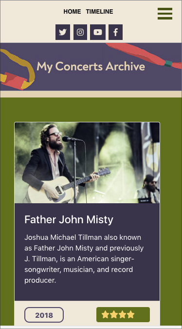

# My Concerts Archive

A React application in which I present all the important music concerts I've attended.

Live demo is available [here](https://silviurdr.github.io/my-concerts-archive/#/)

## Structure of the app

The application is composed of the following components:

* Header - The top area of the app, in which are found: the header image, the navigation links and the social links.

* Concerts - the main content of the home page.

* ConcertsCardDeck - the area in which all the concerts cards are displayed. Each concert card has an image and a footer with year and rating sort buttons.

* Filtering - the component responsible for the filtering of the concerts by genre

* Pagination - present at the bottom of the home page, it's used to navigate between the pages of the ConcertsCardDeck component (12 concert cards displayed per page)

* BurgerMenu - available only for smaller devices, it has the same functions as the Filtering component

* Timeline - placed in a separated page, presents the timeline of the concerts archive

**Screnshots** :

---

## Technologies used 

* React
* JavaScript
* Bootstrap 4
* HTML5
* CSS3
